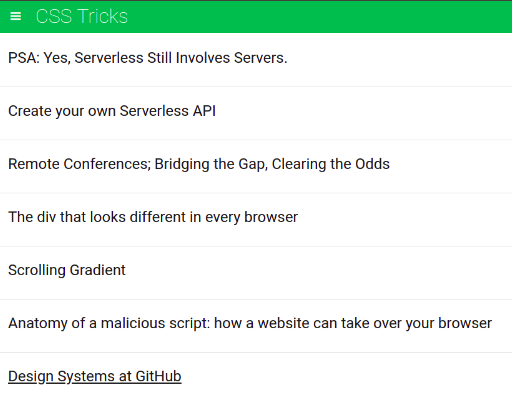
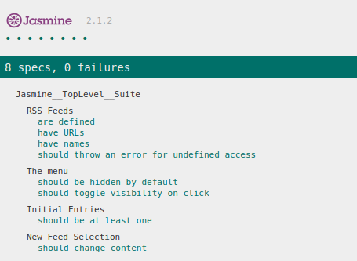

Feedreader-Jasmine-Testing
===============================


Feedreader is one of Udacity front-end nanodegree projects. The project focuses on writing and running comprehensive tests against the Feedreader app. The test suites got to cover the whole aspects of the app including ,but not only, the asynchronous functionality.
The app is live here: 
`https://i-mw.github.io/feedreader`.



## Table of Contents

* [Feedreader](#feedreader)
* [How to use the app](#how-to-use-the-app)
* [Tests](#tests)
* [How to run tests](#how-to-run-tests)
* [How to get the project locally](#How-to-get-the-project-locally)
* [Code dependencies](#code-dependencies)
* [Contributing](#contributing)


## Feedreader

Feedreader, the app, brings feeds from various websites through asynchronous requests and presents them in a visual, orgranized and comfortable way.


## How to use the app

By default, the app shows feed from Udacity (Tests change it immediately to evaluate requests). You can change the feed parsed by clicking on the hamburger icon at the left, that will show the side menu from which you can select new feed to be shown.


# Tests

Tests are written usine Jasmine 2.1.2 library. Tests are detailed covering almost every single aspect of the app, from passive actions, user interactions to asynchronous requests. 8 test specs divided into 4 suites were written and submitted and all of them were confirmed passing at the time of `pushing`. you can read the detailed documented test units and test suites here: `jasmine/spec/feedreader.js`.
You can `clone` the project and add your own tests.


# How to run tests

Whether you want to run tests online or from your local machine, you can do so by loading the main page of the app `index.html`. Tests will run and excute automatically without any action from your side. you will notice some flickering, movement or transitions in the page, these are the actions taken by the test commands to measure, calculate and account the proper functionality. You can watch tests results as they run at the bottom of the page, indicating the success or failure of tests. note that all tests were marked passing at the time of `pushing`.




## How to get the project locally

You can download the whole project using the `Download` button above. or clone it using the command:
```
git clone https://github.com/i-mw/feedreader
```

## Code Dependencies

This project has various code dependencies and they are:

- Jasmine 2.1.2: the main framework of the project, as its used for testing. The project could be update to the latest version of Jasmine in the future.

- Google fonts: to provide Robot font used in design.

- Normalize: helps in perserving consistency in design across different browsers.

- Icomoon: icons provider.

- jQuery 2.1.1: to help fascilite javascript work in selection and event listeners.

- Handlebars 2.0.0: helps with building semantic templates.

- Google API: loads Feedreader API.

- Feeds from Udacity, Css Tricks, HTML5 Rocks and Linear Digressions.


## Contributing

As this project is part of a program and meant only for personal improvement, Its not open for contribution. But you can refer to a feature or a bug in Issues section.